

 

  

<h3 align="center">PexelsApp</h3>
  

  

## Тестовое задание

Задание представляет собой мобильное приложение, аналогичное Pinterest, с использованием PixelApi. Приложение включает в себя три основных экрана с поддержкой навигации и функционалом для отображения разнообразных фотографий. Отображение изображений осуществляется как автоматически, так и в результате пользовательского поиска. Пользователи имеют возможность просматривать изображения в более детальном режиме, а также могут скачивать и добавлять их в закладки. Присутствует поддержка тёмной темы и локализации.

При разработке приложения предусмотрен функционал для выполнения сетевых запросов к PixelApi, механизм хранения информации в базе данных, кэширование данных, а также обработка ошибок, связанных с отсутствием интернет-соединения и отсутствием необходимой информации.

### Список основных используемых технологий

|                         |                                |
|------------------------|-----------------------------------|
| Language               | Kotlin                            |
| Architecture           | Single Activity, Clean Architecture, MVVM |
| Navigation             | Navigation Component              |
| Dependency Injection   | Hilt                      |
| Networking             | Retrofit                          |
| Concurrency            | RxJava                            |
| Storage                | Room                              |
| Image Loading          | Glide                             |
| Splash Screen          | Splash Screen API     |
| Caching                | Retrofit/Glide caching

### Демонстрация проекта
---

* Splash Screen

  
  

  * Home Fragment

  

    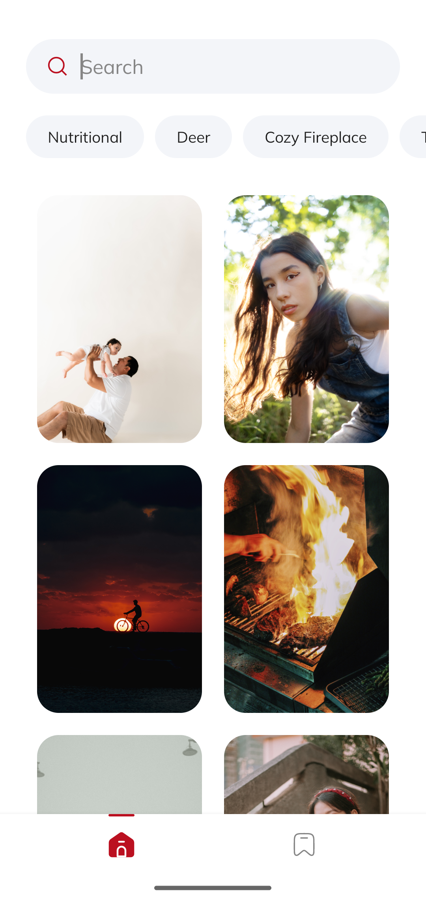
    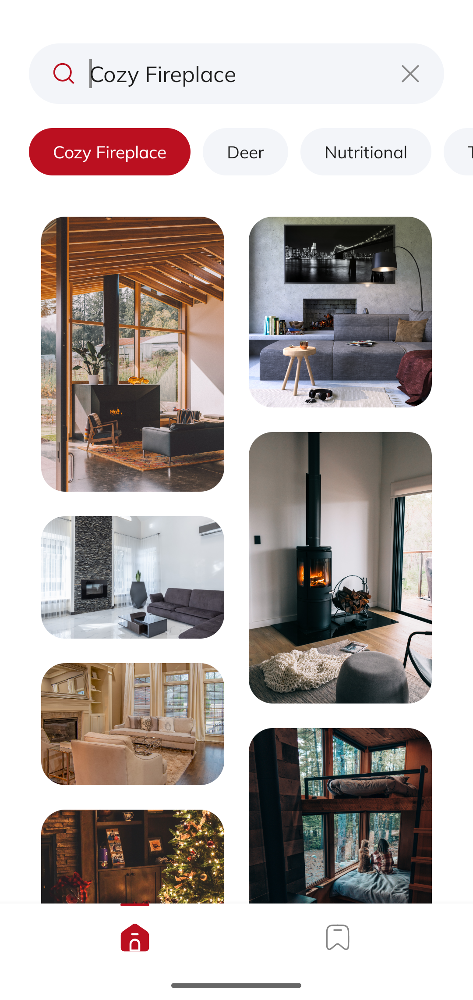
    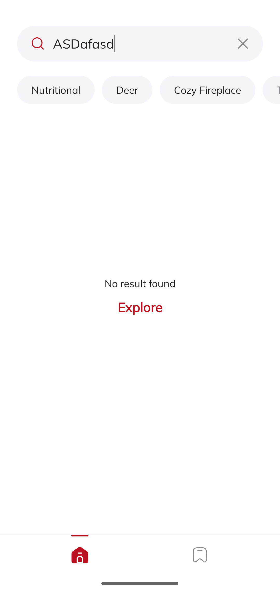
      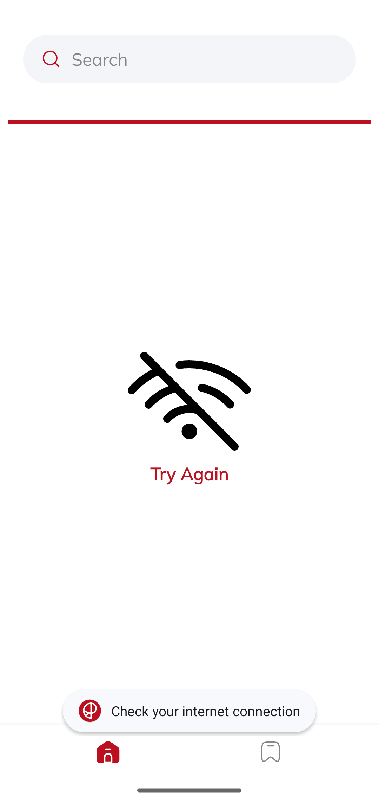    
  

   * Details Fragment

   

  

 

    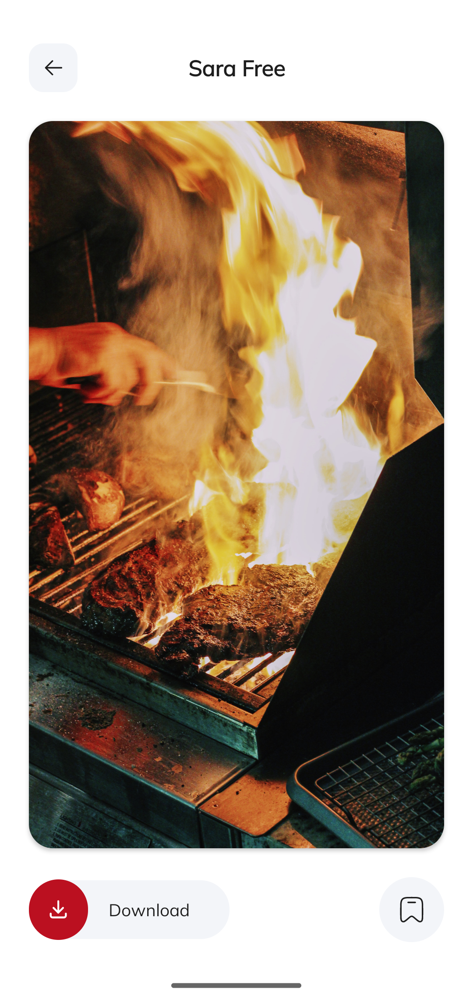
    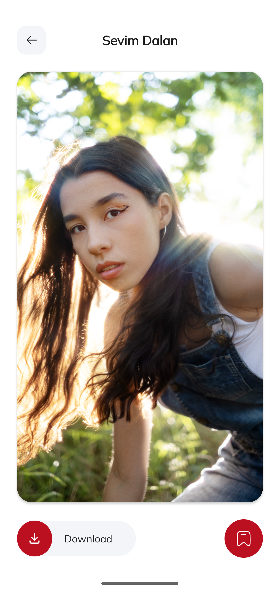
    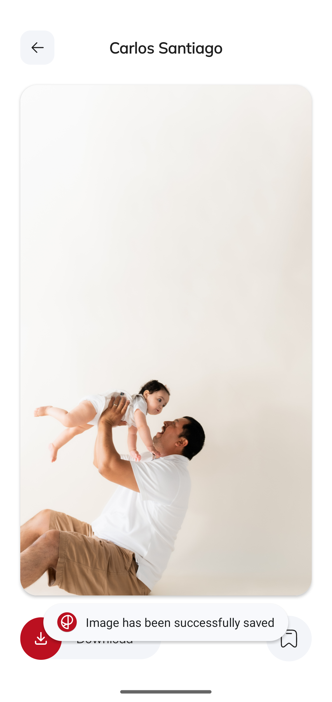
      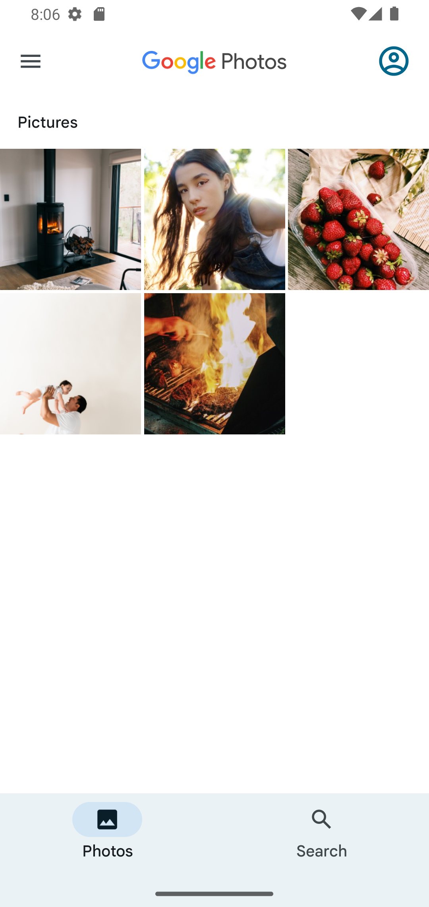    
  

  

  * Bookmarks Fragment

   

  

 

    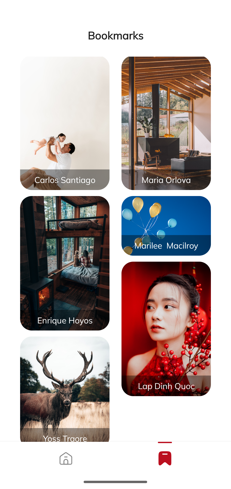
    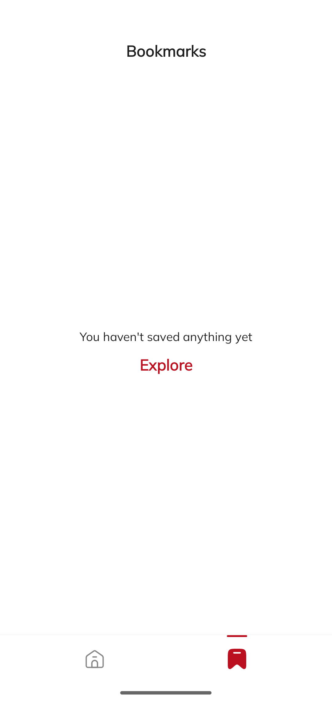  
  

  

  ### Тёмная тема
---

 

  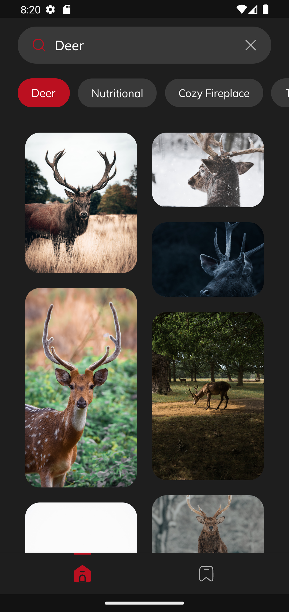
  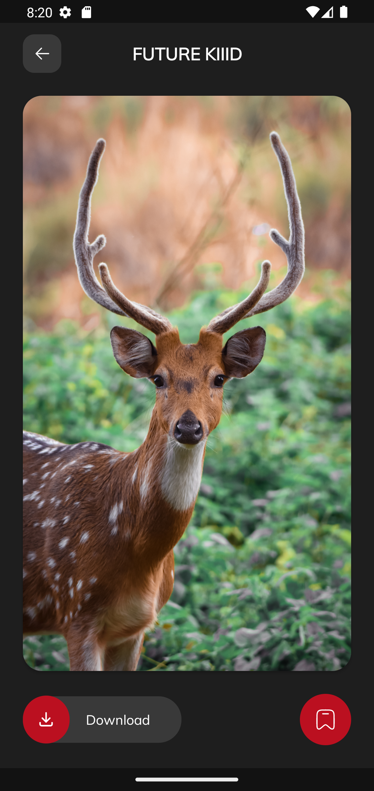
  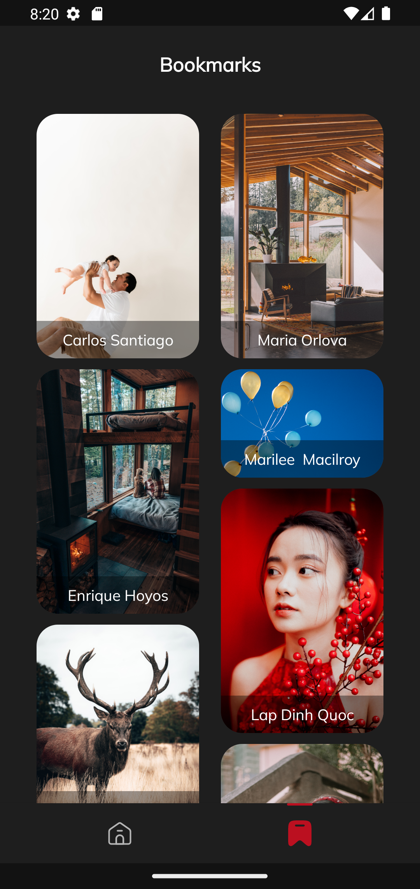  
  

  

  
  ----
  Приложение протестировано на эмуляторе   Android Studio (Google Pixel 4).

  ----
  Также проводилось тестирование на реальном устройстве.

  ----
  ### Тестирование на реальном устройстве
---

 

  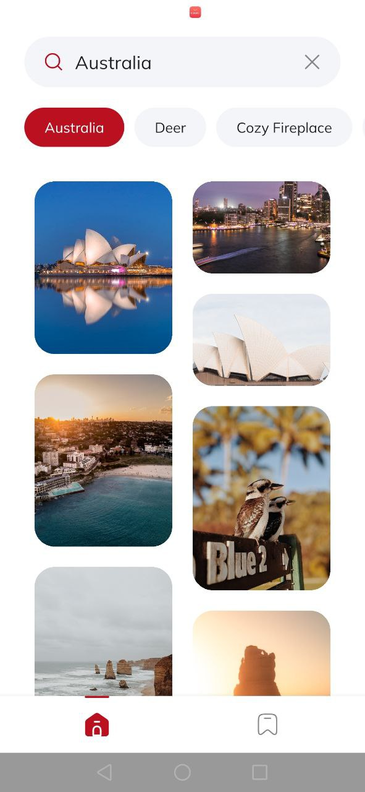
  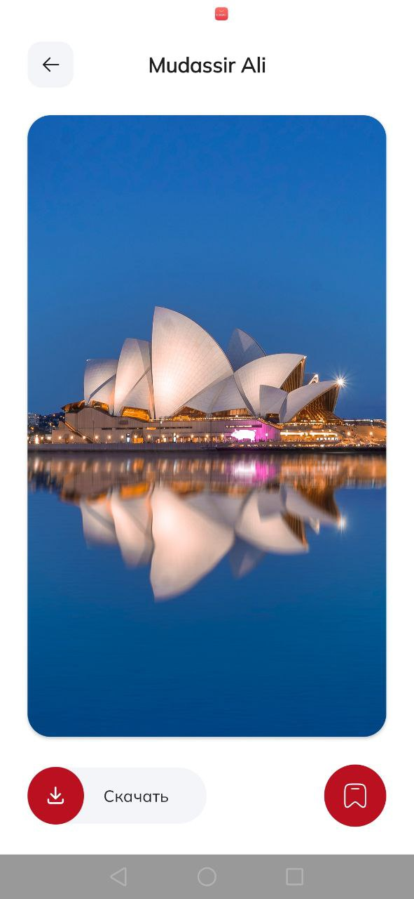
  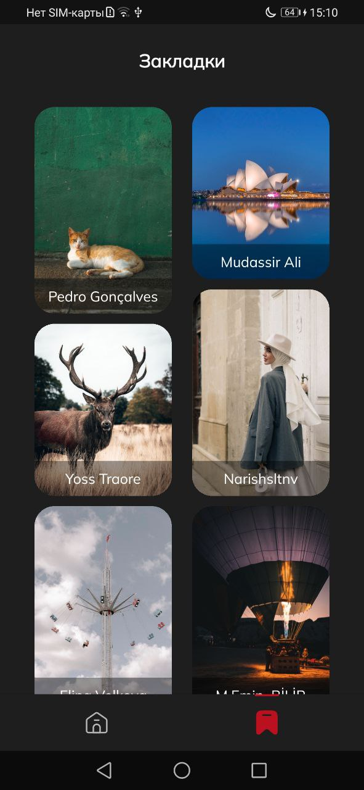  
  

  

  
  ### Возможные улучшения
  ----
  * Разделение репозитория по назначению реализуемых задач.
  * Декомпозирование файла конфигураций отдельно для каждого слоя.
  * Написание логики тестирования приложения.
  * Оптимизация функционала.
  * ...

  

